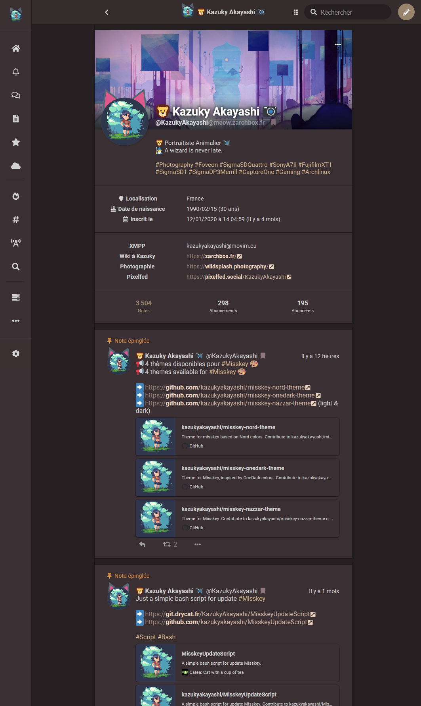

# Misskey Elki Theme
Theme for misskey

# Use

Copy this code on misskey theme editor :

```
{
	id: 'Elki',

	name: 'Elki',
 	author: 'KazukyAkayashi',
	desc: 'Theme',

	base: 'dark',

	props: {
	accent: '#9a846d',
	bg: '#201a1c',
	fg: '#d3d3d3',
	fgHighlighted: '@link',
	panel: '#382c2f',
	navFg: '@fg',
	navHoverFg: '@accent',
	navActive: '@accent',
	navIndicator: '@accent',
	header: 'rgba(56, 44, 47, 0.75)',
	link: '#eed8c4',
	mention: '#d1baa3',
	hashtag: '#cfb48e',
	renote: '#d08770',
	pageBg: '@bg',
	badge: '#917781',
	divider: 'rgba(17, 17, 17, 0.7)',
	driveFolderBg: '@panel',
	},
}
```

# Screenshot


